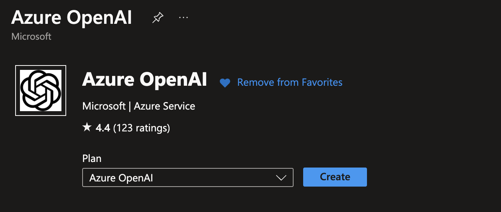
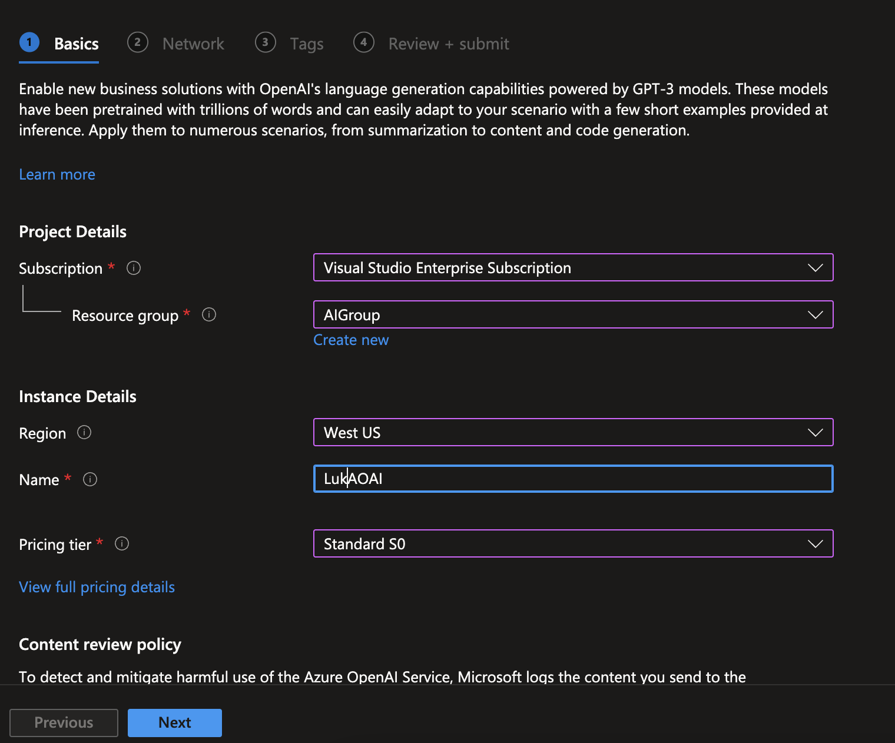

# **第一章：用 SDK 访问 Azure OpenAI Service**

在前言部分，我们了解了大型语言模型的相关知识，下面我想谈谈如何使用大型语义模型，在未进入 Semantic Kernel 之前，我更希望大家看看如何正确通过 SDK 去访问 Azure OpenAI Service 上的 Azure OpenAI 模型。

## **准备工作：在 Azure OpenAI Studio 部署模型**

部署 Azure OpenAI 模型很简单，在申请成功 Azure OpenAI Service 后，通过在 Azure Portal 创建资源进行部署。以下是相关步骤：

1. 在 [Azure Portal](https://portal.azure.com/) 选择 Azure OpenAI 创建资源 

选择 'Create' 后，配置好 Azure OpenAI 所在区域，需要注意：因为资源分布不同，不同区域所拥有的 OpenAI 模型不尽相同，在使用前一定要了解清楚。

等待片刻，即创建成功

2. 进入创建好的资源，你可以部署模型，以及获取 SDK 调用时需要的 Key，以及 Endpoint

3. 进入 'Model Deployment' 选择 'Management Deployment' 进入 Azure OpenAI Studio 

4. 在 Azure OpenAI Studio 部署您的模型

选择你需要的模型

可以看到您的模型列表

恭喜你，成功部署了模型，接下来就可以用 SDK 对接了。

